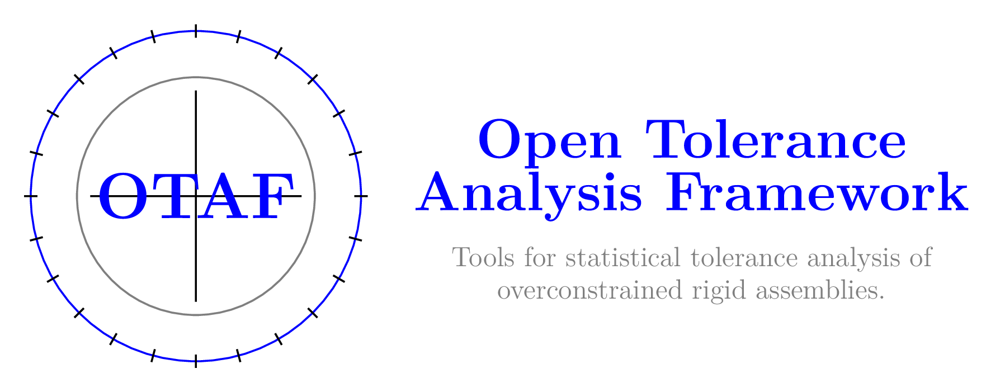

# OTAF: Open Tolerance Analysis Framework

<div align="left">
    
</div>

## 📖 Table of Contents
1. [Introduction](#introduction)
2. [Features](#features)
3. [Installation](#installation)
4. [Getting Started](#getting-started)
5. [Modules](#modules)
6. [Examples](#examples)
7. [Contributing](#contributing)
8. [License](#license)
9. [Acknowledgments](#acknowledgments)

---

## 📚 Introduction

**OTAF** (Open Tolerance Analysis Framework) is an open-source Python library designed for statistical tolerance analysis and modeling of overconstrained 3D mechanical assemblies. It provides tools to quantify uncertainty, perform sensitivity analysis, and optimize tolerance allocations in the context of manufacturing and design. It only handles planar and cylindrical features for now.
This framework aims to address the challenges of probabilistic tolerance analysis by modernizing industrial practices, minimizing manufacturing costs, and reducing waste.

Key use cases include:
- **Modeling Manufacturing Deviations**: Analyze the effects of geometric and dimensional variations.
- **Probabilistic Failure Estimation**: Leverage advanced statistical tools to quantify and mitigate risk.
- **Uncertainty Quantification**: Account for imprecise probabilities in design and manufacturing.

> _"In mechanical design, tolerances are used to define the acceptable geometric space for defects, but ambiguity in their distribution can lead to over- or under-estimated probabilities of failure."_

---

## ✨ Features

- 📐 **Assembly Modeling**: Model and analyze overconstrained 3D assemblies.
- 📊 **Statistical Tolerance Analysis**: Use state-of-the-art tools for robust tolerance modeling.
- 🔬 **Uncertainty Quantification**: Employ imprecise probabilities to address uncertainties in manufacturing.
- ⚙️ **Optimization**: Optimization of the distributions parameters maximizing probabilities of failure
- 📈 **Visualization**: Generate plots to communicate tolerance and uncertainty insights.

---

## 🚀 Installation

To install OTAF, you need Python 3.8+ and `pip`.

[comment]: # (### From PyPI (Upcoming)

[comment]: # (```bash)

[comment]: # (pip install otaf)

[comment]: # (```)

### From Source
```bash
# Clone the repository
git clone https://github.com/Kramer84/otaf.git

# Navigate to the project directory
cd otaf

# Install the package
pip install .

# Install the package wit documentation build dependencies
pip install .[docs]
```

### Dependencies
The following Python libraries are required:
- **Core**: `numpy`, `scipy`, `sympy`, `joblib`, `beartype`
- **Uncertainty Tools**: `openturns`,
- **Visualization**: `matplotlib`, `trimesh`
- **Machine Learning**: `torch`, `torcheval`, `scikit-learn`
- **Geometry**: `triangle`, `pytransform3d[all]`

Check [requirements.txt](requirements.txt) for a complete list.

---

## 🛠️ Getting Started

### Importing the Library
Once installed, you can start using OTAF as follows:
```python
import otaf

# Example: Running a tolerance analysis
results = otaf.run_analysis(input_data)
```

### Documentation
Visit the [OTAF Documentation](https://github.com/Kramer84/otaf/wiki) for detailed guides, examples, and API references.
[View Documentation](https://kramer84.github.io/otaf/)

---

## 🗂️ Modules

OTAF is modular and extensible, with the following key components:

- **`assembly_modeling`**: Base classes for mechanical assemblies.
- **`geometry`**: Geometric definitions and operations.
- **`optimization`**: Tools for constrained tolerance optimization.
- **`sampling`**: Low-discrepancy sampling methods.
- **`uncertainty`**: Probabilistic modeling and failure estimation.

Explore the [source code](https://github.com/Kramer84/otaf) for a complete overview.

---

## 📦 Examples

Explore the `examples/` directory for ready-to-use scripts demonstrating OTAF's capabilities.

### Monte Carlo Simulation
```python
from otaf.sampling import MonteCarloSampler

sampler = MonteCarloSampler(bounds=[(0, 1), (0, 1)], num_samples=1000)
samples = sampler.generate()
```

### Tolerance Zone Visualization
```python
from otaf.plotting import plot_tolerance_zone

plot_tolerance_zone(features, constraints)
```

---

## 🤝 Contributing

We welcome contributions! Whether you're reporting a bug, suggesting a feature, or submitting a pull request, your help is appreciated. There is still a lot of work to make it work efficiently

---

## 📜 License

This project is licensed under the **GNU General Public License v3.0 (GPLv3)**. For details, see the [LICENSE](https://github.com/Kramer84/otaf/blob/main/LICENSE) file.

---

## 🌟 Acknowledgments

This work is supported by the [French National Research Agency (ANR)](https://anr.fr/Projet-ANR-21-CE46-0009) under the project "Analyse des tolérances avec les probabilités imprécises" (ANR-21-CE46-0009). The goal is to develop new formalisms for tolerance analysis based on imprecise probabilities, bridging the gap between theory and industrial applications.
