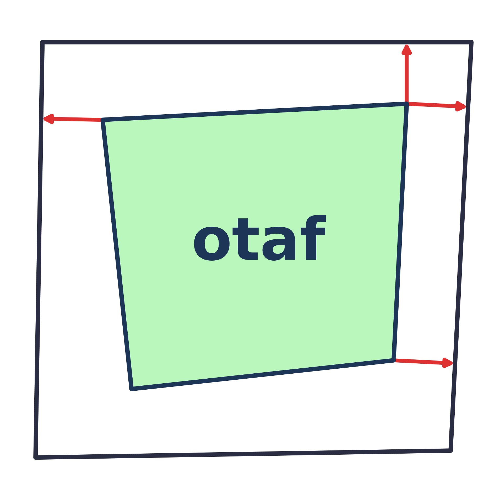

<a id="readme-top"></a>

[![Contributors][contributors-shield]][contributors-url]
[![Forks][forks-shield]][forks-url]
[![Stargazers][stars-shield]][stars-url]
[![Issues][issues-shield]][issues-url]
[![MIT License][license-shield]][license-url]

<!-- PROJECT LOGO -->
<br />
<div align="center">
  <a href="https://github.com/Kramer84/otaf">
    
  </a>

<h3 align="center">OTAF</h3>

  <p align="center">
    <strong>Open Tolerance Analysis Framework</strong>
    <br />
    A scientific Python framework for statistical tolerance analysis of over-constrained mechanical assemblies using linear system-of-constraints optimization.
    <br />
    <br />
    <a href="https://kramer84.github.io/otaf/">Explore the docs</a>
    &middot;
    <a href="https://github.com/Kramer84/otaf/issues">Report Bug</a>
    &middot;
    <a href="https://github.com/Kramer84/otaf/issues">Request Feature</a>
  </p>
</div>

<details>
  <summary>Table of Contents</summary>
  <ol>
    <li>
      <a href="#about-the-project">About The Project</a>
      <ul>
        <li><a href="#key-methodology">Key Methodology</a></li>
        <li><a href="#built-with">Built With</a></li>
      </ul>
    </li>
    <li>
      <a href="#getting-started">Getting Started</a>
      <ul>
        <li><a href="#prerequisites">Prerequisites</a></li>
        <li><a href="#installation">Installation</a></li>
      </ul>
    </li>
    <li><a href="#usage">Usage</a></li>
    <li><a href="#framework-assumptions--capabilities">Framework Assumptions & Capabilities</a></li>
    <li><a href="#roadmap">Roadmap</a></li>
    <li><a href="#contributing">Contributing</a></li>
    <li><a href="#license">License</a></li>
    <li><a href="#contact">Contact</a></li>
    <li><a href="#acknowledgments">Acknowledgments</a></li>
  </ol>
</details>

## About The Project

**OTAF (Open Tolerance Analysis Framework)** is an open-source, research-driven Python library designed to perform statistical tolerance analysis on over-constrained rigid mechanical assemblies. Developed as part of a PhD thesis funded by the French National Research Agency (ANR), the framework maps manufacturing deviations and mechanical joints into standard optimization matrices to evaluate assembly conditions under uncertainty.

In industrial systems with clearances and multi-point contacts (over-constrained mechanisms), the relative kinematics of parts cannot be defined by standard algebraic equations. OTAF solves this by constructing a math-based **System of Constraints (SOC)**, converting 3D variational geometry challenges into bounded linear programming optimizations.

### Key Methodology

The framework transitions high-level assembly descriptions into rigorous mathematical structures through a two-layer model:
1. **Compatibility Loops (Equalities):** Closed kinematic chains (3D tolerance stack-ups) that govern global structural behavior. These are represented as linear matrix operations:
   $$A_{eq,Def} \cdot X + A_{eq,Gap} \cdot Y + K_{eq} = 0$$
2. **Interface Constraints (Inequalities):** Local contact interactions mapped at boundary contour points across matching feature surfaces. These ensure no material interpenetration occurs:
   $$A_{ub,Def} \cdot X + A_{ub,Gap} \cdot Y + K_{ub} \ge 0$$

Where $X$ represents the elementar manufacturing defect vectors ($D$), $Y$ captures internal clearance and gap freedoms ($g$), and $K$ represents nominal constants. 

By injecting an auxiliary slack variable $s$ into the interface constraints via `embedOptimizationVariable()`, the framework determines structural assemblability based on the sign of $s$. If optimization yields $s < 0$, the manufacturing defects exceed the system's geometric compensation capacity, signaling an assembly failure.

<p align="right">(<a href="#readme-top">back to top</a>)</p>

### Built With

* **Core Mathematics & Symbols:** [NumPy](https://numpy.org/), [SciPy](https://scipy.org/), [SymPy](https://www.sympy.org/)
* **Uncertainty Quantification:** [OpenTURNS](https://openturns.github.io/www/)
* **Execution & Parallelization:** [Joblib](https://joblib.readthedocs.io/)
* **Type Integrity Checking:** [Beartype](https://github.com/beartype/beartype)
* **3D Mesh Rendering & Visualization:** [Trimesh](https://github.com/mikedh/trimesh), [Pytransform3d](https://github.com/dfki-ric/pytransform3d)

<p align="right">(<a href="#readme-top">back to top</a>)</p>

## Getting Started

### Prerequisites

OTAF requires Python $\ge$ 3.8. It is highly recommended to isolate installation dependencies inside a virtual environment or Conda environment.

```bash
python3 -m venv otaf_env
source otaf_env/bin/activate

```

### Installation

Install OTAF directly from source along with your required dependency subsets:

```bash
# Clone the repository
git clone [https://github.com/Kramer84/otaf.git](https://github.com/Kramer84/otaf.git)
cd otaf

# Install the base structural engine
pip install .

# Install with 3D visualization and geometry tools
pip install .[viz]

# Install with neural network surrogate modeling tools
pip install .[surrogate]

# Install all components including Sphinx documentation pipelines
pip install .[all]

```

## Usage

### 1. High-Level Assembly Input Formats

Design configurations are passed to the `AssemblyDataProcessor` as nested dictionaries. Features are configured via explicit alphanumeric keys (e.g., Part `1`, surface `a`, point `A0` is labeled `P1aA0`). Coordinate points can be defined natively within global reference frames or mapped relative to local surfaces.

```python
import otaf
import numpy as np

system_data = {
    "PARTS": {
        "1": {
            "a": {
                "FRAME": np.eye(3),  # Surface frame orientation matrix
                "POINTS": {"A0": np.array([0,0,0]), "A1": np.array([1,0,0])},
                "TYPE": "plane",
                "INTERACTIONS": ["P2a"],
                "CONSTRAINTS_D": ["PERFECT"],
                "CONSTRAINTS_G": ["FLOATING"],
            },
        },
        "2": {
            "a": {
                "FRAME": np.eye(3),
                "POINTS": {"A0": np.array([0,0,0]), "A1": np.array([1,0,0])},
                "TYPE": "plane",
                "INTERACTIONS": ["P1a"],
                "CONSTRAINTS_D": ["PERFECT"],
                "CONSTRAINTS_G": ["FLOATING"],
            },
        }
    },
    "LOOPS": {
        "COMPATIBILITY": {
            "L0": "P1aA0 -> P2aA0"  # Compact kinematic chain loop sequence
        }
    },
    "GLOBAL_CONSTRAINTS": "2D_NZ",
}

```

### 2. Matrix Compilation and Feasibility Execution

Once parsed, structural boundaries pass into the constraint compiler to generate standard optimization targets:

```python
from otaf import (
    AssemblyDataProcessor,
    CompatibilityLoopHandling,
    InterfaceLoopHandling,
    SystemOfConstraintsAssemblyModel
)

# 1. Parse raw structural maps and expand topological vector loops
processor = AssemblyDataProcessor(system_data)
processor.generate_expanded_loops()

# 2. Pass the processor to intermediate handlers to compile symbolic equations
comp_handler = CompatibilityLoopHandling(processor)
inter_handler = InterfaceLoopHandling(processor, comp_handler)

# 3. Extract the SymPy expressions and generate the numerical constraint matrices
soc_model = SystemOfConstraintsAssemblyModel(
    compatibility_eqs=comp_handler.get_compatibility_expression_from_FO_matrices(),
    interface_eqs=inter_handler.get_interface_loop_expressions()
)

# 4. Test ideal structural alignment (Zero-Deviation Case)
ideal_test = soc_model.test_zero_deviation_feasibility()
print("Feasible without defects:", ideal_test["success"])

```

### Local Documentation Compilation

To build full API reference catalogs locally, verify `pandoc` is present on your local system:

```bash
sudo apt install pandoc
sphinx-apidoc -o docs/source src/otaf
cd docs/
make clean
make html

```

## Framework Assumptions & Capabilities

* **Dual Probabilistic Scope:** Natively handles classical statistical tolerance analyses using fixed vectors of random standard distributions. For advanced reliability workflows, it supports epistemic uncertainty methods (imprecise probabilities) to trace upper and lower response envelopes (probability-boxes) by altering standard deviation allocations ($\lambda$-spaces) and internal variable correlations.
* **Rigid Variational Modeling:** Analysis is strictly bounded to rigid transformations (translations and rotations). Non-rigid parameters, micro-deformations, thermal growth, and volumetric stress changes are excluded.
* **Manual Feature Injections:** Custom operational requirements or functional conditions can be injected manually into the optimization queue as additional independent vector loops.
* **Computational Scaling & Surrogates:** Standard Monte Carlo studies ($10^6$ trials) scale efficiently through the linear programming backend and typically complete in under an hour via `joblib` parallel processing. The neural network-based surrogate modeling package (`otaf.surrogate`) is explicitly optimized to mitigate calculation bottlenecks encountered during extensive multi-dimensional optimization loops within imprecise probability space exploration.
* **Cylinder Processing Workaround:** High-level automated boundary matching contains known algorithmic parsing limitations for cylinder-to-cylinder interactions. Users analyzing complex multi-primitive cylindrical joints should bypass automated generation scripts and leverage the validated, hand-coded 30-DOF and 50-DOF reference models located in `src/otaf/example_models/models_3_D/`.

## Roadmap

OTAF is fully functional for standard planar operations and customized Torsor-based matrix allocations. The active development roadmap targets upgrading automated generation paths to bridge research theory with production-grade CAD ecosystems:

* [ ] **Graph-Theoretic Topology Engines:** Implement automated closed-loop kinematic path detection using topological graph theory to eliminate manual loop configurations.
* [ ] **Generalized Surface Joint Parsers:** Abstract boundary interface mechanics to support direct geometric contact extraction across arbitrary matching surface normals.
* [ ] **Intrinsic Dimension Variability:** Support intrinsic component variance tracking (e.g., individual part radius changes) as stochastically independent parameters alongside rigid-body displacement profiles.
* [ ] **Part-Internal Joint Tracking:** Enable the generation of isolated clearance loops for interdependent matching surfaces residing entirely inside a single complex physical part.
* [ ] **CAD Ecosystem Integration:** Develop open APIs to directly extract geometric coordinates and surface topology bounds from modern open CAD formats.

## Contributing

Contributions to refine algorithmic stability or expand analytical capabilities are welcome.

1. Fork the Project
2. Create your Feature Branch (`git checkout -b feature/AmazingFeature`)
3. Commit your Changes (`git commit -m 'Add some AmazingFeature'`)
4. Push to the Branch (`git push origin feature/AmazingFeature`)
5. Open a Pull Request

## License

Distributed under the **MIT License**. See `LICENSE` for more information.

## Contact

**Kristof Attila S.** - ksimady@sigma-clermont.fr

**Project Link:** [https://github.com/Kramer84/otaf](https://github.com/Kramer84/otaf)

## Acknowledgments

This structural research framework was funded and supported by the **French National Research Agency (ANR)** under project **TRIP: ToleRance analysis with Imprecise Probabilities** (Grant Number: [ANR-21-CE46-0009](https://anr.fr/Projet-ANR-21-CE46-0009)). The framework aims to implement innovative formalisms for statistical tolerancing, helping bridge the gap between abstract epistemic uncertainty theory and industrial mechanical applications.


[contributors-shield]: https://img.shields.io/github/contributors/Kramer84/otaf.svg?style=for-the-badge
[contributors-url]: https://github.com/Kramer84/otaf/graphs/contributors
[forks-shield]: https://img.shields.io/github/forks/Kramer84/otaf.svg?style=for-the-badge
[forks-url]: https://github.com/Kramer84/otaf/network/members
[stars-shield]: https://img.shields.io/github/stars/Kramer84/otaf.svg?style=for-the-badge
[stars-url]: https://github.com/Kramer84/otaf/stargazers
[issues-shield]: https://img.shields.io/github/issues/Kramer84/otaf.svg?style=for-the-badge
[issues-url]: https://github.com/Kramer84/otaf/issues
[license-shield]: https://img.shields.io/github/license/Kramer84/otaf.svg?style=for-the-badge
[license-url]: https://github.com/Kramer84/otaf/blob/main/LICENSE